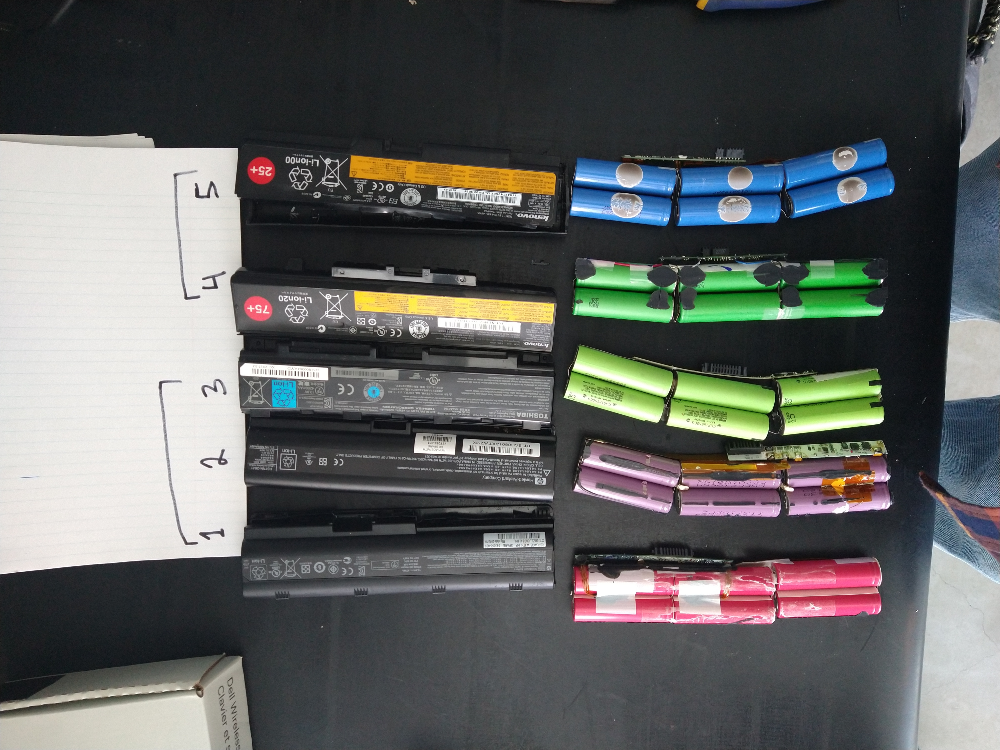
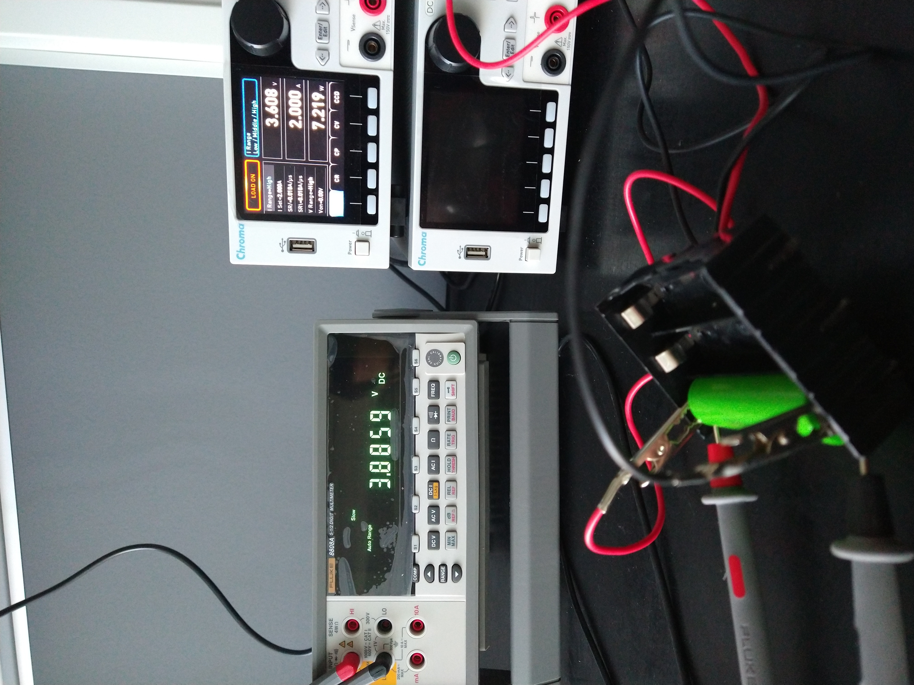
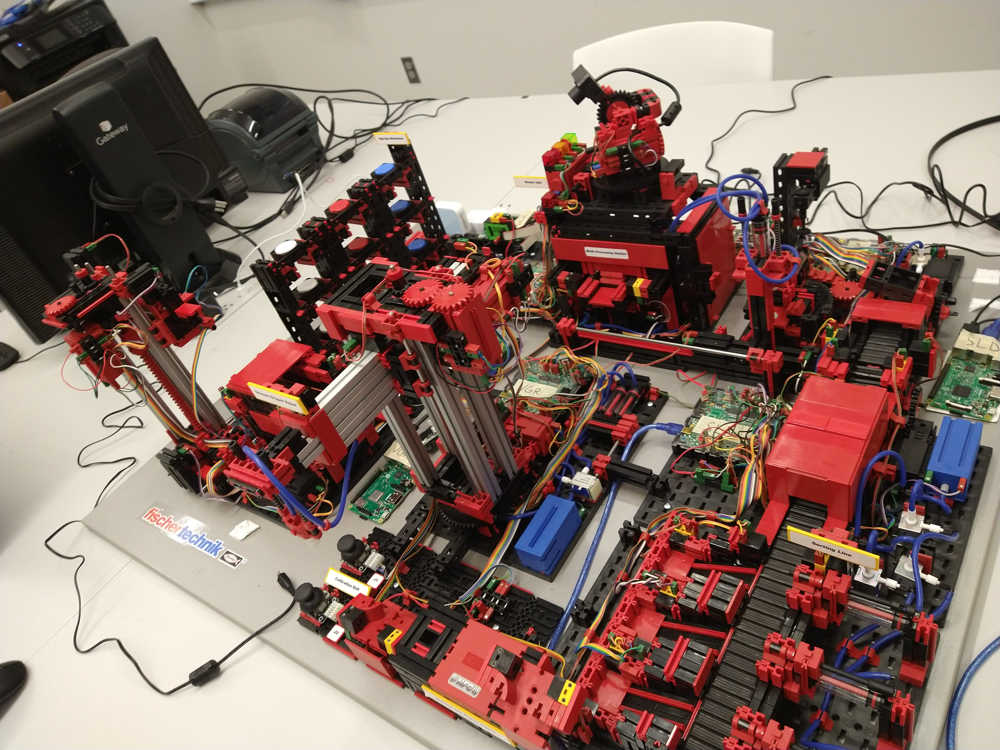
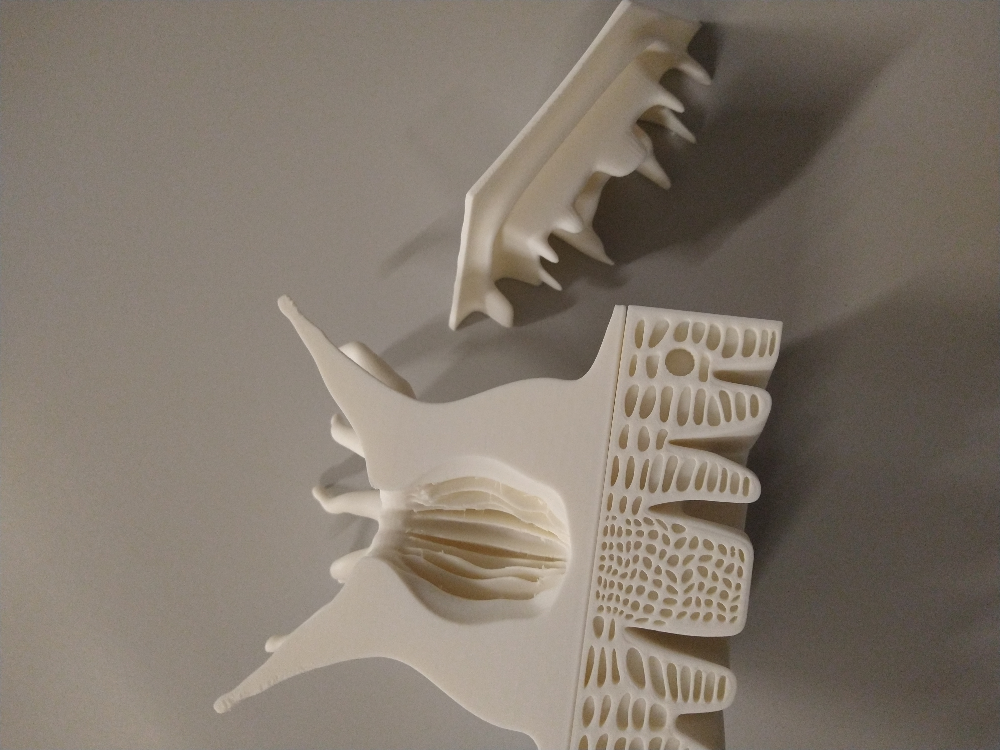

# Engineering Portfolio

I wanted to showcase some of my work, so I created this portfolio

### Education

* Systems Engineering, MS | University of Rhode Island 2024 |
* Industrial and Systems Engineering, BS | University of Rhode Island 2022 |

ul marg

### 3D Printing and Enclosure Designs
   

 

# Lasers

